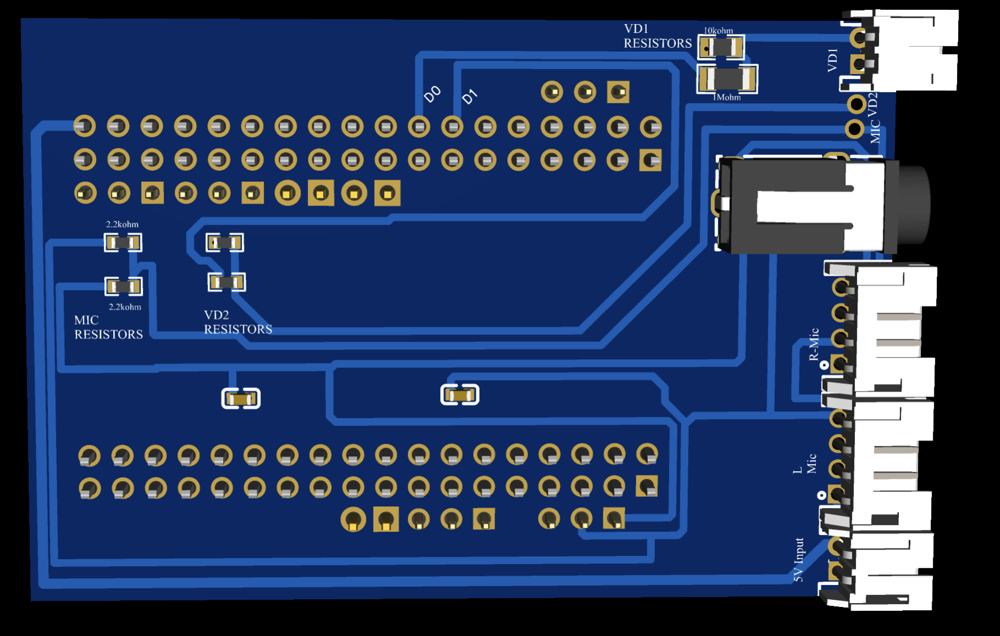

# Bela Cape — Bela Gem Stereo

> A custom BeagleBone expansion cape for low-latency stereo audio I/O, dual-channel microphone input, digital event triggering, and sensor interfacing — built on the [Bela real-time audio platform](https://bela.io).



---

## Table of Contents

- [Overview](#overview)
- [Repository Structure & File Guide](#repository-structure--file-guide)
- [Board Variants in This Repository](#board-variants-in-this-repository)
- [Hardware Overview](#hardware-overview)
- [Component Reference](#component-reference)
  - [BeagleBone Expansion Headers (P1 & P2)](#beaglebone-expansion-headers-p1--p2)
  - [3.5 mm Stereo Audio Jack](#35-mm-stereo-audio-jack)
  - [Right Microphone Input — R-Mic Connector](#right-microphone-input--r-mic-connector)
  - [Left Microphone Input — L-Mic Connector](#left-microphone-input--l-mic-connector)
  - [MIC Resistor Network (2× 2.2 kΩ)](#mic-resistor-network-2-22-kΩ)
  - [VD1 Resistor Network (10 kΩ + 1 MΩ)](#vd1-resistor-network-10-kΩ--1-mΩ)
  - [Digital Trigger Lines — D0](#digital-trigger-lines--d0--d1)
  - [Power Connectors (VD1, MIC VD2, 5V Input)](#power-connectors-vd1-vd2-mic-vd2-5v-input)
  - [Decoupling Capacitors](#decoupling-capacitors)
- [Power Architecture](#power-architecture)
- [Signal Routing & Design Rationale](#signal-routing--design-rationale)
- [Connector Pinouts](#connector-pinouts)
- [Layer Stack](#layer-stack)

---

## Overview

The **Bela Cape (Bela Gem Stereo)** is a two-layer PCB designed to expand the [Bela](https://bela.io) embedded audio platform with:

- **Stereo audio output** via a standard 3.5 mm TRS jack
- **Independent left and right microphone inputs** via dedicated JST-style edge connectors
- **Dual-channel microphone bias networks** for MEMS microphone PCB
- **High-impedance voltage divider networks** for biosignal or high-voltage sensor conditioning
- **Two digital trigger/sync lines (D0, D1)** for real-time event marking with external instruments
- **Dedicated power input (5V)** and multiple regulated supply rails (VD1, VD2) for clean analog operation
- **Full BeagleBone P8/P9 header passthrough** across two 36-pin expansion connectors

---

## Repository Structure & File Guide

```
Bela Cape/
│
├── PCB_Assembly_Files/            # Production-ready fabrication package
│   ├── BOM_BelaCape.csv           #   Bill of Materials (component list)
│   └── CPL_BelaCape.csv           #   Centroid/pick-and-place file for PCBA
│
├── 3D_BelaCape.step               # Full 3D mechanical model (STEP format)
│                                  #   → Use in FreeCAD, SolidWorks, KiCad, or
│                                  #     Fusion 360 for enclosure design and
│                                  #     mechanical clearance verification
│
├── BelaCape_Topview.png           # Rendered top-view image of the PCB
│
├── Bela_Cape_schematics.pdf       # Complete circuit schematic
│                                  #   → Primary reference for signal tracing,
│                                  #     net names, and component values
│
├── Gerber_BelaCape.zip            # Gerber + Excellon drill files
│                                  #   → Send to any PCB fab to order boards
│                                  #   → Tested with JLCPCB, PCBWay, Aisler
│
├── InteractiveBOM_BelaCape.html   # Browser-based interactive Bill of Materials
│                                  #   → Click any component to highlight its
│                                  #     location on the PCB layout image
│                                  #   → Invaluable during soldering & debugging
│
├── PCB_BelaCape.pdf               # Printable PCB layout (all layers)
│
├── PCB_BelaCape.png               # High-resolution PCB layout image
│
└── Readme.MD                      # This file
```

### Quick-Reference: Which File Do I Need?

| Goal | File to Use |
|------|-------------|
| Order bare PCBs | `Gerber_BelaCape.zip` |
| Order fully assembled PCBs (PCBA) | `PCB_Assembly_Files/` folder |
| Understand the circuit | `Bela_Cape_schematics.pdf` |
| Solder components yourself | `InteractiveBOM_BelaCape.html` |
| Design an enclosure | `3D_BelaCape.step` |
| Visual reference during assembly | `BelaCape_Topview.png` / `PCB_BelaCape.png` |

---

## Board Variants in This Repository

The KiCad project contains schematics for multiple sub-circuits, visible in the tab bar of the schematic editor:

| Schematic Tab | Description |
|---------------|-------------|
| `Bela_Gem_Stereo` | Top-level schematic — full board with stereo audio and dual mic |
| `Left_Mic` | Left microphone input sub-circuit (bias network, signal conditioning) |
| `Bela_Cape_Schematics` | Cape-level integration schematic (header connections, power routing) |

The **3D render** (`3D Bela_Gem_Stereo`) and **2D PCB layout** (`Bela_Gem_Stereo`) correspond to this repository's primary deliverable.

---

## Hardware Overview

---

## Component Reference

### BeagleBone Expansion Headers (P1 & P2)

The board carries **two dual-row 2×18 (36-pin) through-hole headers** mirroring the BeagleBone's P8 (top, P1) and P9 (bottom, P2) expansion connectors.

- **P1 (Top header):** Connects to BeagleBone P8 — GPIO, digital I/O, timers, SPI, UART
- **P2 (Bottom header):** Connects to BeagleBone P9 — analog inputs (ADC), I2C, power rails (3.3V, 5V, GND, VDD_ADC)

The square-pad pin markers at positions 1, 2 (and select sub-groups) of each header identify signal breakout groups — small JST or 0.1" connector clusters that route specific signals (L, R audio; Mic; VIN; GND; VD1; VD2) to edge-mounted connectors for cable attachment.

**Design rationale:** Full header passthrough allows this cape to be used as a **base layer in a multi-cape stack**, preserving all BeagleBone signals for additional boards above it.

---

### 3.5 mm Stereo Audio Jack

- **Location:** Right-centre edge of the board (physically dominant component)
- **Type:** PCB-mount 3.5 mm TRS stereo jack (vertical orientation, confirmed from 3D render)
- **Signals:** Left audio (L), Right audio (R), Ground (GND)
- **Optional:** TRRS variant can carry a 4th ring for microphone return

This jack provides the main **audio output** for the Bela system — suitable for headphones, amplified speakers, line-level recording equipment, or monitoring during a live performance.

**Design rationale:** The Bela audio codec outputs stereo at up to 96 kHz / 16-bit. A standard 3.5 mm jack provides universal compatibility with consumer and professional audio gear without additional adapters.

---

### Right Microphone Input — R-Mic Connector

- **Location:** Right edge, labelled `R-Mic` in the 3D render
- **Type:** 2-pin edge connector (JST-PH or equivalent)
- **Signals:** MIC signal (+), GND (−)
- **Bias:** Provided by the MIC Resistor Network (see below)

Connects a **right-channel MEMS microphone PCB ** or a pre-biased microphone module directly to the cape's analog front-end.

---

### Left Microphone Input — L-Mic Connector

- **Location:** Right edge, labelled `L-Mic` in the 3D render (below R-Mic)
- **Type:** 2-pin edge connector
- **Signals:** MIC signal (+), GND (−)
- **Bias:** Provided by the MIC Resistor Network (see below)

Mirrors the R-Mic connector for **left-channel microphone input**, enabling true stereo capture.

**Design rationale:** Separate physical connectors for each microphone channel allow independent placement of PCBs (e.g. spaced stereo, ORTF configuration) without a shared cable bundle.

---

### MIC Resistor Network (2× 2.2 kΩ)

- **Location:** Lower-left area, labelled `MIC RESISTORS.`
- **Components:** 4× SMD resistors — two 2.2 kΩ resistors per channel (Left and Right)
- **Function:** MEMS microphone PCB DC bias supply

Microphones contain an internal FET that requires a small DC bias current (typically 0.1–0.5 mA). The 2.2 kΩ resistors form a **bias-T network**, feeding DC bias from the VD2 supply rail through the resistor while allowing the AC audio signal to pass through to the ADC.

```
VD2 ──[2.2kΩ]──┬── MIC capsule (+) ──► to ADC input
                │
               [2.2kΩ]
                │
               GND
```

**Design rationale:** 2.2 kΩ is a standard value for electret biasing — low enough to supply adequate current, high enough to limit power dissipation. Separate networks per channel prevent left-right crosstalk through a shared bias node.

---

### VD1 Resistor Network (10 kΩ + 1 MΩ)

- **Location:** Top-right, labelled `VD1 RESISTORS`
- **Components:** 1× 10 kΩ SMD resistor + 1× 1 MΩ SMD resistor
- **Function:** High-ratio voltage divider to supply 33mV input to OpenBCI

This network creates a **100:1 voltage divider**:

```
Sensor signal ──[1MΩ]──┬──► to OpenBCI input (VD1 net)
                        │
                      [10kΩ]
                        │
                       GND
```

- Input impedance: ~1 MΩ (high — minimises loading on the source)
- Attenuation: ×0.01 (100:1 — scales a 3.3 V signal down to 33 mV, or a 180 mV biosignal to 1.8 mV)
- Output rail: `VD1`

---

### Digital Trigger Lines — D0 & D1

- **Location:** Upper-centre area, clearly labelled `D0` and `D1` on the PCB silkscreen
- **Signal level:** 3.3 V TTL (BeagleBone GPIO)
- **Drive capability:** Driven directly by BeagleBone PRU (Programmable Real-time Unit) for sub-microsecond latency
- **Routed to:** Both the P1 header passthrough and a dedicated breakout group

These are **event synchronisation/stimulus trigger outputs**. The Bela PRU can toggle D0 or D1 with nanosecond-scale jitter, making them suitable for:

| Application | How D0/D1 Is Used |
|-------------|-------------------|
| EEG research | Pulse marks stimulus onset in the EEG data stream |

---

### Power Connectors (VD1, VD2, MIC VD2, 5V Input)

All visible on the right edge of the board in the 3D render:

| Connector Label | Location | Function |
|----------------|----------|----------|
| `VD1` | Top-right edge | Regulated supply output for VD1 domain (or input from external regulator) |
| `VD2` | Right edge (upper) | Regulated supply for VD2 / analog front-end domain |
| `MIC VD2` | Right edge | Dedicated supply feed to microphone bias resistors from VD2 rail |
| `5V Input` | Bottom-right edge | **Main power input** — 5 V DC supply for the entire cape |

The `5V Input` connector allows the cape to be **powered independently** from the BMS 5V supply, which is important when driving external microphone capsules and analog conditioning circuits that demand cleaner, more stable power than USB can reliably provide.

**Design rationale:** Separating the microphone supply (`MIC`) from 5V and from Bela's 3.3V input prevents DSP switching noise from coupling into the sensitive microphone bias path — a common source of audio artefacts in embedded audio systems.

---

### Decoupling Capacitors

- **Location:** Two SMD capacitors visible in the mid-board area (white-outlined rectangular pads in the 3D render)
- **Type:** Likely 100 nF (0.1 µF) ceramic SMD, standard 0402 or 0603 footprint
- **Function:** High-frequency power supply decoupling

Placed along the main signal routing channels, these capacitors:
- Filter switching noise from the BeagleBone's digital logic from coupling into analog paths
- Provide local charge reservoirs to suppress voltage droops during rapid current demands
- Reduce ground bounce on the shared power rails

Additional smaller decoupling capacitors are present adjacent to the VD1, VD2, and MIC resistor networks (visible as smaller gold pads throughout the board).

---

## Power Architecture

```
External 5V ──► [5V Input connector]
                        │
                        ├──► VIN rail (distributed to headers, P9.5/P9.6)
                        │
                        ├──► [Regulator or divider] ──► VD1 rail ──► VD1 connector
                        │                                              VD1 resistor network
                        │
                        └──► [Regulator or divider] ──► VD2 rail ──► VD2 connector
                                                                   
```

> The exact regulation topology (LDO, switching, or passive) is confirmed in `Bela_Cape_schematics.pdf`.

**Ground plane:** The entire bottom copper layer acts as a continuous ground plane, providing a low-impedance return path for all signals and acting as an EMI shield between the two layers.

---

## Signal Routing & Design Rationale

### Why Separate VD1 and VD2 Domains?

Analog circuits are highly sensitive to supply noise. By splitting the supply into two independently decoupled domains:
- **VD1** serves the high-impedance sensor/divider path (quieter, high-Z load)
- **VD2** serves as another set of resistor divider circuit, if the user wants to use it for different onset detection/ event marking. 

This prevents the microphone bias current transients from modulating the sensor reference voltage on VD1.

### Why a Solid Ground Plane?

The blue bottom layer (B.Cu) is a **solid copper pour tied to GND**. This:
- Minimises return path inductance for high-frequency signals
- Shields analog signals from digital switching noise emitted by the BeagleBone's processor
- Reduces crosstalk between the left and right microphone channels
- Improves audio signal-to-noise ratio (SNR)

### Trace Width Strategy

- **Wide red traces** (top layer): Power rails (VIN, VD1, VD2, GND connections) — wider traces lower DC resistance and handle higher current
- **Narrow traces**: Audio signal lines (L, R, MIC), digital lines (D0, D1) — routed away from power to minimise interference

### Why Edge Connectors for Mic and Power?

The R-Mic, L-Mic, VD1, VD2, MIC VD2, and 5V Input are all mounted on the **right board edge** — this layout keeps all external cable connections in one accessible area, allows the cape to sit flush in a rack or enclosure, and prevents cables from interfering with the BeagleBone's USB and Ethernet ports on the opposite end.

---

## Connector Pinouts

> The table below is derived from PCB labels and 3D render inspection. **Always cross-reference with `Bela_Cape_schematics.pdf`** for confirmed pin assignments before wiring external hardware.

### Right-Edge Connectors (top to bottom)

| Connector | Pin 1 | Pin 2 | Notes |
|-----------|-------|-------|-------|
| VD1 | VD1 (+) | GND | Regulated supply |
| VD2 | VD2 (+) | GND | Regulated supply |
| MIC VD2 | MIC VD2 (+) | GND | Mic bias supply |
| Audio Jack | L (tip) | R (ring) + GND (sleeve) | 3.5mm TRS |
| R-Mic | MIC signal | GND | Right capsule |
| L-Mic | MIC signal | GND | Left capsule |
| 5V Input | 5V (+) | GND | Main power in |

### BeagleBone Header — Key Signals (P9 / P2)

| P9 Pin | Signal | Cape Usage |
|--------|--------|-----------|
| P9.1–2 | GND | Ground |
| P9.3–4 | 3.3V | Logic supply |
| P9.5–6 | 5V | VIN |
| P9.33 | AIN4 | ADC input (VD1 divider output) |
| P9.35–40 | AIN0–5 | ADC inputs for sensors/mic |

> Full P8/P9 pin mapping: refer to the [BeagleBone Black System Reference Manual](https://github.com/beagleboard/beaglebone-black/wiki/System-Reference-Manual).

---

## Layer Stack

| Layer | Colour in PCB Viewer | Role |
|-------|---------------------|------|
| F.Cu (Top) | Red | Signal routing, power distribution |
| B.Cu (Bottom) | Blue | Solid GND plane + secondary routing |
| F.SilkS | White text | Component references, net labels |
| F.Courtyard | Yellow outlines | Component keep-out boundaries |
| Edge.Cuts | Board outline | PCB boundary definition |

---

### Binaural / Stereo Microphone Recording

Connect MIC PCBs to L-Mic and R-Mic for real-time binaural audio capture. Bela's 44.1/48 kHz ADC with < 1 ms round-trip latency enables live processing (convolution reverb, beamforming, spatial audio).

### Analog Sensor Interfacing

Use the VD1 high-impedance divider (10 kΩ / 1 MΩ) to connect sensors that output signals above the BeagleBone's ADC range (0–1.8 V), including piezoelectric transducers, photovoltaic cells, or EEG front-end outputs.

---


