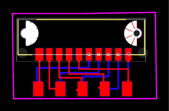

# CeeGrid Anschluss — cEEGrid-to-OpenBCI Connector Adapter

> A small passthrough adapter PCB that breaks out OpenBCI electrode channels to a Samtec connector, allowing **cEEGrid** ear-EEG electrode arrays to be plugged directly into an OpenBCI board.



---

## Overview

The **CeeGrid Anschluss** ("Anschluss" = German for "connection") board is a simple two-sided breakout adapter. It has no active components — it exists purely to re-route OpenBCI's pin spacing/order to match the connector used on commercial **cEEGrid** electrode arrays, so the cEEGrid cable can be connected with a single plug instead of loose jumper wires.

---

## Repository Structure & File Guide

```
CeeGrid Anschluss/
│
├── Assembly files/              # Pick-and-place data for PCBA ordering
│   └── PickAndPlace_CeeGrid.csv
│
├── CeeGrid Anschluss.sch        # Schematic (KiCad)
├── CeeGrid Anschluss.brd        # PCB layout (KiCad)
├── Gerber_CEEgrids.zip          # Gerber + drill files — send to any PCB fab
├── PCB_CeeGrid.png              # Rendered top-view image of the PCB
└── Readme.md                    # This file
```

| Goal | File to Use |
|------|-------------|
| Order bare PCBs | `Gerber_CEEgrids.zip` |
| Order assembled PCBs (PCBA) | `Assembly files/` |
| Understand/edit the circuit | `CeeGrid Anschluss.sch` / `.brd` |
| Visual reference | `PCB_CeeGrid.png` |

---

## Connector Used

**Samtec MB1-120-01-F-S-02-SL** — 1.00 mm Mini Edge Card Socket with Guides

- Single-row edge-card socket, up to 50 pins, 1.00 mm pitch
- Includes card guides for easy, repeatable alignment when plugging in the cEEGrid cable's edge connector
- Current rating: 2.4 A max · Voltage rating: 250 VAC / 354 VDC max
- Accepts 0.031" (0.80 mm) and 0.062" (1.60 mm) thick edge cards

🔗 Buy / datasheet: [samtec.com/products/mb1-120-01-f-s-02-sl](https://www.samtec.com/products/mb1-120-01-f-s-02-sl)

---

## Hardware Overview

- **Top side:** Samtec MB1-120-01-F-S-02-SL edge card socket — the cEEGrid array's cable plugs straight into this
- **Bottom side (and mirrored on top):** Five **2×5 copper-pour pads**, sized for soldering the **male header pins coming from the OpenBCI board**
- **No actives, no passives** — purely a 1:1 (re-ordered) signal passthrough between the OpenBCI header pins and the Samtec connector pins

### Design Rationale

1. **OpenBCI side:** A 2×5 male header is soldered onto OpenBCI's electrode header pins.
2. **CeeGrid Anschluss board:** Solders directly onto those male pins via the 2×5 copper-pour footprints (present on both sides of the board so it can be mounted either way up).
3. **cEEGrid side:** A Samtec connector is soldered on top of the board, and the cEEGrid array's own cable simply plugs into it.

The internal routing (visible as the red/blue traces in the layout) re-maps each OpenBCI pin to the correct Samtec pin position, since the two connectors don't share the same pin order.

This turns a fiddly multi-wire connection into a **single plug-in connector**, reducing wiring errors and making it fast to swap cEEGrid arrays between sessions.

---

## Layer Stack

| Layer | Role |
|-------|------|
| Top copper | Samtec connector pads + routing |
| Bottom copper | Mirrored 2×5 OpenBCI header pads + routing |
| Edge cuts | Board outline |

---

