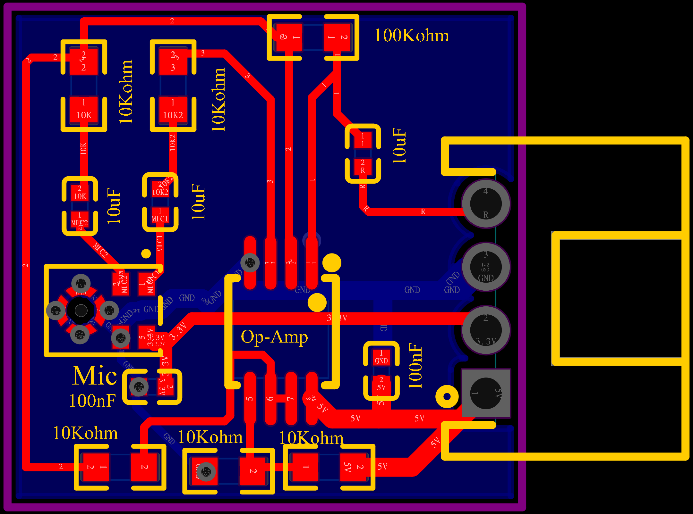

# MIC PCB — MEMS Microphone Amplifier Module

> A compact, high-performance MEMS microphone front-end for the [nEEGlace](https://github.com/nEEGlace-OSH) open-source wearable EEG necklace. Captures acoustic context with an ultra-high dynamic range MEMS capsule and conditions its differential output through a precision zero-drift op-amp, delivering a clean single-ended analog signal to the nEEGlace acquisition system.



---

## Table of Contents

- [Overview](#overview)
- [Repository Structure & File Guide](#repository-structure--file-guide)
- [Hardware Overview](#hardware-overview)
- [Key Specifications](#key-specifications)
- [Component Reference](#component-reference)
  - [MEMS Microphone — ICS-40638 (TDK InvenSense)](#mems-microphone--ics-40638-tdk-invensense)
  - [Operational Amplifier — MAX74810 (Analog Devices / Maxim)](#operational-amplifier--max74810-analog-devices--maxim)
  - [Gain Resistors (10 kΩ × 4)](#gain-resistors-10-kω--4)
  - [Feedback Resistor (100 kΩ)](#feedback-resistor-100-kω)
  - [AC Coupling Capacitors (10 µF × 3)](#ac-coupling-capacitors-10-µf--3)
  - [Output Connector (4-pin)](#output-connector-4-pin)
- [Circuit Architecture](#circuit-architecture)
  - [Stage 1 — MEMS Microphone Output](#stage-1--mems-microphone-output)
  - [Stage 2 — Differential-to-Single-Ended Conversion & Amplification](#stage-2--differential-to-single-ended-conversion--amplification)
  - [Gain Calculation](#gain-calculation)
  - [Frequency Response](#frequency-response)
  - [Noise Analysis](#noise-analysis)
- [Power Architecture](#power-architecture)
- [Signal Routing & Design Rationale](#signal-routing--design-rationale)
- [Connector Pinout](#connector-pinout)
- [Layer Stack](#layer-stack)

---

## Overview

The **MIC PCB** is a self-contained MEMS microphone amplifier module developed as part of the **nEEGlace** open-source wearable EEG necklace project. It captures acoustic context using the **TDK InvenSense ICS-40638** — an analog MEMS microphone with an ultra-high 138 dB SPL acoustic overload point and 63 dB SNR — then amplifies the differential output through the **Analog Devices MAX74810**, a precision dual-channel zero-drift op-amp with 5.8 nV/√Hz input noise.

Together, these components form a microphone front-end with exceptional dynamic range and noise performance, designed specifically for wearable neurotechnology applications where acoustic context must be captured alongside EEG signals in noisy, real-world environments.

**Why these components matter for nEEGlace:**
- The ICS-40638's 138 dB AOP means the module survives loud environments (concerts, transport, labs with ventilation noise) without clipping — preserving the acoustic event markers used to align EEG epochs
- The MAX74810's zero-drift architecture eliminates DC offset drift over temperature — critical for a wearable device whose operating temperature changes as it warms against the user's skin
- The integrated EMI filters on both ICs provide robustness against the RF interference from the nEEGlace's wireless communication components

---

## Repository Structure & File Guide

```
hardware/MIC/
│
├── Assembly files/                  # Production-ready fabrication package
│   ├── BOM_Mic_PCB.csv              #   Bill of Materials (component list with part numbers)
│   └── PickAndPlace_Mic_PCB.csv     #   Centroid / pick-and-place file for PCBA
│
├── 3D_Mic.step                      # Full 3D mechanical model (STEP format)
│                                    #   → Use in FreeCAD, SolidWorks, KiCad, or
│                                    #     Fusion 360 for enclosure and wearable
│                                    #     necklace housing design
│
├── Gerber_Mic_PCB.zip               # Gerber + Excellon drill files
│                                    #   → Send to any PCB fab to order bare boards
│
└── PCB_Mic.png                      # High-resolution PCB layout image
```

### Quick-Reference: Which File Do I Need?

| Goal | File |
|------|------|
| Order bare PCBs | `Gerber_Mic_PCB.zip` |
| Order fully assembled PCBs (PCBA) | `Assembly files/` folder |
| Solder components yourself | `Assembly files/BOM_Mic_PCB.csv` |
| Design an enclosure / wearable housing | `3D_Mic.step` |
| Visual reference during assembly | `PCB_Mic.png` |

> **Note:** A schematic PDF and Interactive BOM (ibom.html) are not yet present in this directory — see [Recommended Additions](#recommended-additions-for-research-use). These are the two most important missing documents for anyone who wants to understand or reproduce this design.

---

## Hardware Overview

## Component Reference

### MEMS Microphone — ICS-40638 (TDK InvenSense)

- **Location:** Bottom-left, large multi-pad circular footprint labelled `Mic`
- **Manufacturer:** TDK InvenSense
- **Part number:** ICS-40638
- **Package:** 5-terminal LGA, 3.50 × 2.65 × 0.98 mm, bottom-port
- **Supply:** 3.3 V (within the 1.52–3.63 V operating range)
- **Current:** 170 µA typical

**What makes this a MEMS microphone (not electret):**

Unlike a traditional electret condenser capsule, the ICS-40638 integrates three components into a single silicon package:
1. **MEMS microphone element** — a microfabricated silicon diaphragm and backplate, acting as a pressure-sensitive capacitor
2. **Impedance converter** — an internal circuit that buffers the extremely high-impedance MEMS element output
3. **Differential output amplifier** — outputs two complementary signals (MIC+ and MIC−) for noise-immune signal transmission

Because the ICS-40638 has an **internal impedance converter and output amplifier**, it does **not** require an external bias resistor network — a key difference from traditional electret capsules. The 3.3 V supply powers the internal circuitry directly via the VDD pin; no external biasing components are needed.


**Bottom-port assembly note:**

The ICS-40638 is a **bottom-port** microphone — the acoustic port faces down, through a hole in the PCB. When assembling:
- A sound port hole (0.5–1.0 mm diameter recommended) must be present in the PCB beneath the mic footprint
- Do **not** apply solder paste over the sound hole
- Align the package's port hole with the PCB hole precisely during pick-and-place

**Datasheet:** [ICS-40638 Datasheet — TDK InvenSense](https://invensense.tdk.com/download-pdf/ics-40638-datasheet/)

---

### Operational Amplifier — MAX74810 (Analog Devices / Maxim)

- **Location:** Centre of board, SOIC-8 package, labelled `Op-Amp`
- **Manufacturer:** Analog Devices (formerly Maxim Integrated)
- **Part number:** MAX74810
- **Package:** SOIC-8 (8-pin, 1.27 mm pitch SMD)
- **Supply:** 5 V single supply (within 4.5–50 V operating range)

**Why the MAX74810 is the right choice here:**

The MAX74810 is a **zero-drift (chopper-stabilised)** op-amp — its internal architecture continuously corrects its own input offset voltage using a 4.8 MHz chopping clock. This means:

- **No DC offset drift:** Offset voltage stays at ≤ 7 µV regardless of temperature, ageing, or supply variation. For a wearable device cycling between ambient and skin temperature, this eliminates baseline wander in the amplified microphone signal.
- **1/f noise elimination:** The chopping technique modulates low-frequency (flicker) noise to 4.8 MHz and then filters it out — leaving only the 5.8 nV/√Hz broadband noise floor. At audio frequencies, this is extremely clean.
- **EMI immunity:** Integrated 200 Ω series input resistors + common-mode capacitors at the input form a built-in EMI filter — protecting the sensitive front-end from the wireless transceiver and EEG amplifier clocks on the nEEGlace main board.
- **Rail-to-rail output:** Full output swing on a 5 V supply maximises dynamic range before ADC clipping.
- **Wide supply range (4.5–50 V):** The 5 V supply here is well within the comfortable operating range, leaving voltage headroom margin.

**Datasheet:** [MAX74810 — Analog Devices](https://www.analog.com/en/products/MAX74810.html)

---

### Gain Resistors (10 kΩ × 4)

- **Location:** Upper-left area
- **Designators:** `10K` (×2, left column, net `MIC C2`) + `10K2` (×2, right column, net `MIC C1`)
- **Package:** SMD 0402 or 0603

These four resistors serve two distinct roles:

**Role 1 — Gain setting (R_gain in feedback network):**
In the non-inverting amplifier configuration:
```
Gain = 1 + (R_feedback / R_gain) = 1 + (100kΩ / 10kΩ) = 11×
```

**Role 2 — Virtual mid-rail bias (for each differential channel):**
The ICS-40638 outputs two complementary signals biased at VDD/2 (≈ 1.65 V on a 3.3 V supply). The 10 kΩ resistors set the op-amp's input bias point to match this mid-rail reference, ensuring the amplifier operates in the centre of its linear range on a single 5 V supply.

Having two 10 kΩ resistors per channel (10K and 10K2) also forms a matched pair for the two differential input legs of the op-amp — the symmetry minimises common-mode error and improves CMRR.

**Design rationale:** 10 kΩ is the standard recommendation from the MAX74810 datasheet to minimise offset voltage error due to input bias current (V_OS_error = I_B × R_source; lower R reduces this). It also keeps the gain network impedance low enough to avoid susceptibility to parasitic capacitance at audio frequencies.

---

### Feedback Resistor (100 kΩ)

- **Location:** Top-centre, labelled `100Kohm`
- **Package:** SMD 0402 or 0603
- **Function:** Sets the closed-loop gain of the amplifier in conjunction with the 10 kΩ gain resistors

```
Gain (Av) = 1 + (R_feedback / R_gain)
           = 1 + (100,000 / 10,000)
           = 11×
           ≈ 20.8 dB
```

This resistor sits in the negative feedback path from the op-amp output back to the inverting input (−), closing the feedback loop that stabilises and defines gain.

**Design rationale:** The MAX74810 datasheet recommends setting R_feedback = 10 kΩ to minimise offset; here the 100 kΩ value was chosen to achieve 11× gain, prioritising signal amplitude over absolute minimum offset. The MAX74810's extremely low native offset (7 µV max) means the additional offset contribution from the 100 kΩ feedback impedance remains negligible (50 pA × 100 kΩ = 5 µV) — well within the ADC's resolution.

The resulting gain-bandwidth product consumption at 11×:
```
f_-3dB = GBW / Av_closed = 2.7 MHz / 11 ≈ 245 kHz
```
This exceeds the 20 kHz audio band by more than an order of magnitude — no bandwidth limitation in the audible range.

---

### AC Coupling Capacitors (10 µF × 3)

Three 10 µF SMD capacitors handle AC coupling at different points in the signal chain:

| Position | Net | Function |
|----------|-----|----------|
| Left column (MIC C1) | MIC1 signal path | Blocks DC bias from ICS-40638 output (+), passes audio |
| Left column (MIC C2) | MIC2 signal path | Blocks DC bias from ICS-40638 output (−), passes complementary audio |
| Right side (near connector) | Op-amp output / supply | Output AC coupling or supply decoupling at the connector |

**Why AC coupling is essential with the ICS-40638:**

The ICS-40638's differential outputs are biased at VDD/2 ≈ 1.65 V DC. Without AC coupling, this 1.65 V DC offset would appear at the op-amp output as 1.65 V × 11 = 18.15 V — far exceeding the 5 V supply and saturating the amplifier entirely. The 10 µF capacitors block this DC, passing only the AC audio signal:

```
ICS-40638 MIC+ ──[10µF]──► Op-Amp Non-inv. (+)
ICS-40638 MIC− ──[10µF]──► Op-Amp Inv. (−) [via gain network]
```

**High-pass filter cutoff:**
```
f_cutoff = 1 / (2π × R × C)
          = 1 / (2π × 10,000 × 0.00001)
          ≈ 1.6 Hz
```

This cutoff is well below the ICS-40638's own 35 Hz lower limit, so the coupling capacitors introduce no additional bandwidth restriction. The effective system low-frequency cutoff is determined by the MEMS microphone (35 Hz), not the coupling caps.

**Design rationale:** 10 µF was chosen to achieve a low cutoff without using physically large electrolytic capacitors. Using SMD ceramic or tantalum 10 µF in 0603 or 0805 package keeps the board compact — essential for a wearable module.

---

### Output Connector (4-pin)

- **Location:** Right edge, 4-pin through-hole header
- **Connects to:** nEEGlace main acquisition board or Bela Cape `R-Mic`/`L-Mic` connectors

| Pin | Label | Signal | Direction |
|-----|-------|--------|-----------|
| 4 | R | Amplified audio output (Right channel) | Output |
| 3 | GND | Ground | Common |
| 2 | 3.3V | 3.3 V supply | Input (from host) |
| 1 | 5V | 5 V supply for op-amp | Input (from host) |

The host board supplies both 3.3 V (for the ICS-40638) and 5 V (for the MAX74810) to the module through this connector, keeping the MIC PCB free of its own voltage regulators — minimising component count and board area.

---

## Circuit Architecture

### Stage 1 — MEMS Microphone Output

```
                    ┌─────────────────────────────────────┐
                    │         ICS-40638                    │
                    │                                      │
3.3V ──────────────►│ VDD                                  │
                    │         MIC+ (≈ VDD/2 + audio/2) ──►│──[10µF]──► to Op-Amp (+)
         [Sound]──► │ MEMS element + impedance converter   │
                    │         MIC− (≈ VDD/2 − audio/2) ──►│──[10µF]──► to Op-Amp (−)
GND ───────────────►│ GND                                  │
                    └─────────────────────────────────────┘
```

The ICS-40638 outputs a **differential pair** — MIC+ and MIC− are complementary, each carrying half the audio signal amplitude with opposite polarity around a VDD/2 ≈ 1.65 V DC midpoint. This differential signalling provides:
- Common-mode noise rejection (any noise picked up by both lines cancels at the op-amp differential input)
- Double the signal amplitude compared to a single-ended output (improves SNR)
- Enhanced RF immunity — matching the ICS-40638's own built-in RF immunity enhancement

### Stage 2 — Differential-to-Single-Ended Conversion & Amplification

```
MIC+ ──[10µF]──────────────────────────────────────────► (+) ─┐
                                                                │  MAX74810
MIC− ──[10µF]──[10K gain resistor]──────────────────► (−) ─┤  Channel A  ├──► R output
                                                                │            │
                               GND ──[10K bias]─────────► (+) │  └─[100K]──┘ (feedback)
                                                               └─────────────────────────
```

The MAX74810 Channel A amplifies the difference between MIC+ and MIC−, rejecting common-mode noise. Channel B of the dual op-amp may buffer the 3.3V/2 virtual mid-rail reference, or handle a second microphone channel (MIC2) — confirm from the schematic PDF.

### Gain Calculation

```
Gain (Av) = 1 + (R_feedback / R_gain)
           = 1 + (100 kΩ / 10 kΩ)
           = 11×  ≈ 20.8 dB
```

**Expected output amplitudes:**

The ICS-40638 has −43 dBV sensitivity at 1 Pa (94 dB SPL), meaning its differential output is approximately 7 mV peak at 1 Pa:

| Sound level | Mic output (differential) | After 11× gain | Note |
|-------------|--------------------------|----------------|------|
| 40 dB SPL (quiet room) | ~0.07 mV | ~0.77 mV | ADC-readable |
| 60 dB SPL (conversation) | ~0.7 mV | ~7.7 mV | Comfortable level |
| 80 dB SPL (busy street) | ~7 mV | ~77 mV | Good ADC range |
| 100 dB SPL (loud music) | ~70 mV | ~770 mV | Well within 5V supply |
| 138 dB SPL (AOP limit) | ~565 mV | ~6.2 V | Clipped at supply — AOP is device limit |

At the operating supply of 5 V with rail-to-rail output, the MAX74810 saturates at ~5 V output. The ICS-40638's own AOP (138 dB) sets the ultimate input limit, not the amplifier — a well-matched design decision.

### Noise Analysis

**System input-referred noise (estimated):**

The dominant noise source at audio frequencies is the MAX74810's voltage noise (5.8 nV/√Hz), as the ICS-40638's internal amplifier presents a low-impedance output that does not contribute significantly to thermal noise at the op-amp input.

```
Output noise density ≈ 5.8 nV/√Hz × 11 (gain) = 63.8 nV/√Hz

Integrated noise (20 Hz – 20 kHz bandwidth):
  = 63.8 nV/√Hz × √(20,000 − 20)
  = 63.8 nV/√Hz × 141.4 Hz^0.5
  ≈ 9.0 µV RMS at output

Input-referred:
  = 9.0 µV / 11 ≈ 0.82 µV RMS
```

This is well below the ICS-40638's own noise floor (63 dB SNR → ~0.35 mV RMS noise at 1 Pa, 94 dB SPL), meaning the MAX74810 adds negligible noise — the system noise is dominated by the microphone, as intended.

---

## Power Architecture

```
5V Input (pin 1 connector)
    │
    └──► MAX74810 V+ (pin 8, SOIC-8)
         Rail-to-rail output stage
         Single-supply, ground-sensing input

3.3V Input (pin 2 connector)
    │
    └──► ICS-40638 VDD
         Powers MEMS element, impedance converter,
         and internal differential output amplifier

GND (pin 3 connector)
    └──► MAX74810 V− (pin 4)
         ICS-40638 GND
         Decoupling cap returns
         Solid ground plane (bottom copper layer)
```

**Why two separate supply voltages:**

- **3.3 V for ICS-40638:** The MEMS mic operates between 1.52–3.63 V; 3.3 V is the standard logic rail on the nEEGlace system, providing a stable, clean supply with no additional regulation needed. Using a voltage within the MEMS mic's rated range (rather than the maximum) also reduces the quiescent current slightly.

- **5 V for MAX74810:** Running the op-amp on 5 V rather than 3.3 V provides a larger output voltage swing headroom. With an 11× gain and the ICS-40638's mid-rail bias at 1.65 V, the amplified signal can swing ±(1.65 × 11) V before hitting the rails — on 5 V, the MAX74810's rail-to-rail output allows the full 0–5 V range, giving approximately 2.5 V of headroom above and below the output bias point.

**Power decoupling:** The ICS-40638 datasheet recommends a 0.1 µF ceramic capacitor placed as close as possible to its VDD pin. This is provided by one of the 10 µF capacitors on the board, which also covers the lower-frequency decoupling requirement. Additional smaller decoupling (100 nF) is recommended in any revised layout.

---

## Signal Routing & Design Rationale

### Why a Dedicated Daughter Board?

Isolating the MEMS microphone front-end onto a separate module rather than integrating it into the nEEGlace main PCB provides:

- **Acoustic placement flexibility:** The microphone module can be positioned on the necklace at the point of best acoustic capture (e.g. front-centre, close to the throat) independently of the main electronics PCB
- **Electrical isolation from digital noise:** The ICS-40638 and MAX74810 are both sensitive to supply noise. Physical separation from the BeagleBone/microcontroller and EEG front-end reduces coupling of switching noise into the audio signal path
- **Modularity:** Upgrade from mono to stereo by adding a second MIC PCB, or swap to a different MEMS capsule without redesigning the main board
- **Thermal separation:** Wearable devices warm unevenly; isolating the mic module allows it to reach thermal equilibrium independently of the main processor's heat dissipation

### Ground Plane

The blue bottom copper layer is a **solid GND plane**, which:
- Provides a low-inductance return path for the 170 µA ICS-40638 supply current
- Shields the nV-level MEMS output signals from radiated EMI generated by the nEEGlace wireless components
- Reduces 50/60 Hz hum pickup — the MAX74810's PSRR of −81 dB already rejects most supply-borne hum, but the ground plane prevents it from coupling via the input pins

### Compact Layout

Resistors and capacitors are clustered tightly around the MAX74810 to keep the signal path between the ICS-40638 output and the op-amp input as short as possible. Long traces on these high-impedance signal nodes act as antennas; minimising their length directly reduces noise pickup. The ICS-40638 should be as close to the op-amp input pins as the coupling caps allow.

---

## Connector Pinout

### Output Connector (4-pin, right edge)

| Pin | Signal | Direction | Voltage | Notes |
|-----|--------|-----------|---------|-------|
| 1 | 5V | Input | 5.0 V | Op-amp supply — from host board |
| 2 | 3.3V | Input | 3.3 V | MEMS mic supply — from host board |
| 3 | GND | Common | 0 V | Ground reference |
| 4 | R | Output | 0–5 V AC | Amplified audio, right channel |

Connect to the nEEGlace main board MIC header, or to the Bela Cape's `R-Mic` / `L-Mic` connectors with signal on pin 4 and power on pins 1–2.

---

## Layer Stack

| Layer | Colour in PCB Viewer | Role |
|-------|---------------------|------|
| F.Cu (Top) | Red | Signal routing, component pads, power traces |
| B.Cu (Bottom) | Blue | Solid GND plane |
| F.SilkS | Yellow labels | Component values and net names |
| F.Courtyard | Yellow outlines | Component keepout boundaries |
| Edge.Cuts | Purple border | PCB boundary |

---

### Post-Assembly Test

```
1. Apply 5V between connector pin 1 and pin 3 (GND)
2. Apply 3.3V between connector pin 2 and pin 3 (GND)
3. Verify: current draw ~170 µA on 3.3V rail (ICS-40638 quiescent)
4. Monitor connector pin 4 (R) with oscilloscope:
   - DC level: ~VDD/2 × gain bias point (check vs. schematic)
   - Speak or tap 30 cm from mic: expect 10–100 mV AC swing for speech
5. Check for oscillation at 4.8MHz (MAX74810 chopping clock) — should be
   invisible at audio frequencies due to internal filtering
```

---
